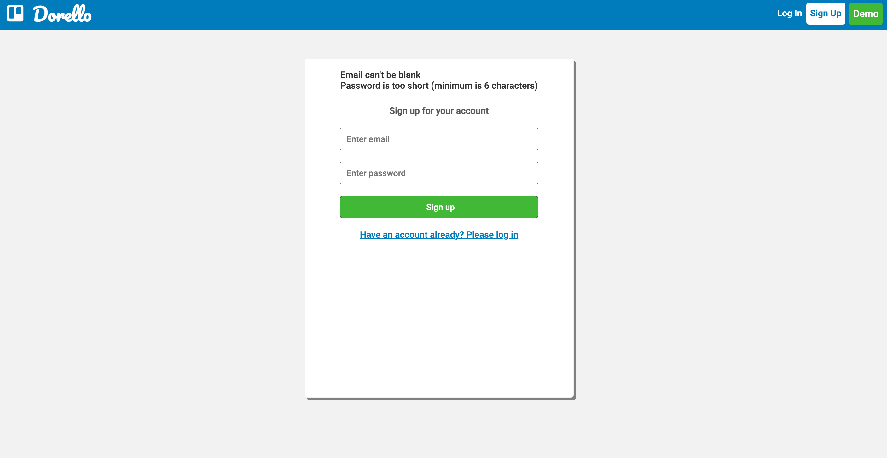

# Dorello

## [Live Site](https://dorellokp.herokuapp.com/#/)

## Introduction:
Dorellos is a Trello clone. It is a project management application that allows the users to collaborate with one another on a project. Teams can manage their workflow by creating a board for a project and creating lists and cards that show action items to be completed. 

## Technologies:

Backend:
* Ruby on Rails v.2.5.1
* PostgreSQL - v13c

Frontend:
* React - ^17.0.1
* Redux - ^4.0.5
* Webpack - ^5.10.0

Hosting:
* Heroku

Additonal technologies:
* [BCrypt](https://github.com/codahale/bcrypt-ruby): for secure user authentication v3.1.7
* [FontAwesome](https://fontawesome.com/): for icons
* [Unsplash Source](https://source.unsplash.com/): for background images

## Features:
User Auth

Users can log in, sign up, or try the demo version of the application to use full features, using the buttons in the navigation bar. BCrypt secures the passwords  and randomly generates session tokens which are stored in cookies. The session tokens are destroyed upon logging out. 

Board Create

Users are able to create boards and are able to acces the board to create lists and cards

