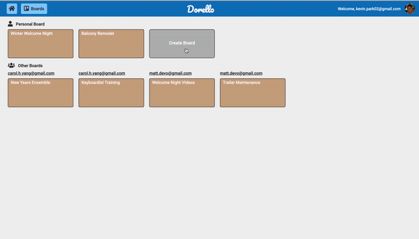
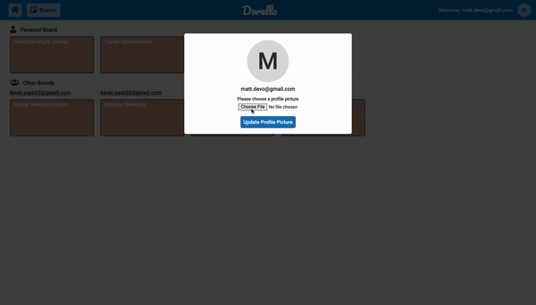
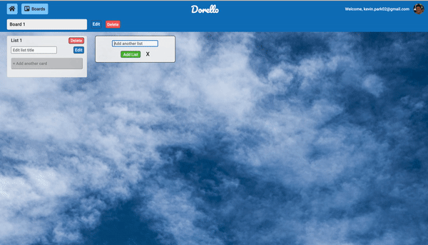

# Dorello

## [Live Site](https://dorellokp.herokuapp.com/#/)


## Introduction:
Dorellos is a Trello clone. It is a project management application that allows the users to collaborate with one another on a project. Teams can manage their workflow by creating a board for a project and creating lists and cards that show action items to be completed. 

## Technologies:

Backend:
* Ruby on Rails v.2.5.1
* PostgreSQL - v13c

Frontend:
* React - ^17.0.1
* Redux - ^4.0.5
* Webpack - ^5.10.0

Hosting:
* Heroku

Additonal technologies:
* [BCrypt](https://github.com/codahale/bcrypt-ruby): for secure user authentication v3.1.7
* [FontAwesome](https://fontawesome.com/): for icons
* [Unsplash Source](https://source.unsplash.com/): for background images

## Features:

### User Authentication


Users can log in, sign up, or try the demo version of the application to use full features, using the buttons in the navigation bar. BCrypt secures the passwords  and randomly generates session tokens which are stored in cookies. The session tokens are destroyed upon logging out. 

### Board, Lists, Cards, and Comments

Users can create a board to start a project. Inside the board, lists are created and within the lists, action items (cards) can be created and assigned a due date. Clicking on a card open up a modal where a user can set a due date for the action item, write a description. Different people involved in the project can comment in the card for discussions



### AWS S3 Image Upload

Users can upload their profile pictures. Implemented Rails Active Storage and set up a bucket in S3 to display the photo file in React.

In the model, has_one_attached association was made between the profile photo and the user

```
has_one_attached :photo
```

When returning a json response, if the user had a photo uploaded, the photoUrl attribute in the user slice of state was extracted. If the user had no photo available, only the user id and email were extracted. The reason is, the browser displayed an error if the user did not have the photoUrl attribute available, and the conditional case was necessary as shown below:

```
if user.photo.attached?
    json.extract! user, :id, :email
    json.photoUrl url_for(user.photo)
else
    json.extrat! user, :id, :email
end
```

In the frontend, the user is allowed to upload a profile picture as show below


The uploading of the photo was handled by designing the form as such:
```
<form onSubmit={this.handleSubmit}>
    <h5>Please choose a profile picture</h5>
    <input type="file"
            onChange={this.handleFile}/>
    <input type="submit" value="Update Profile Picture"/>
</form>
```
```
handleFile(e) {
    this.setState({photoFile: e.target.files[0]});
}
```
```
handleSubmit(e) {
        const formData = new FormData();
        if (this.state.photoFile) {
            formData.append('user[photo]', this.state.photoFile);
        }
        $.ajax({
            url: `/api/users/${this.props.currentUser.id}`,
            method: "PATCH",
            data: formData,
            contentType: false,
            processData: false
        })
    }
```
### Modal 
Created a modal function where two separate forms (card edit form and comment form) appear as shown below.


Action creator of opening modal was set to take place when the card is clicked:
```
<Link onClick={this.handleClick} to={`/boards/${board.id}/${card.id}`}>
    <div className="card-container">
        <li className="card-name">{card.name}</li>
        {due}
    </div>
</Link>
```
```
handleClick(e) {
    e.preventDefault();
    this.props.openModal('edit', this.props.card.id)
}
```
And the Modal function would display the appropriate component when the modal opens:
```
function Modal({modal, cardId, closeModal}) {
    if (!modal) {
        return null;
    }

    let component;
    switch (modal) {
        case 'edit':
            component = <EditCardFormContainer cardId={cardId}
                                               closeModal={closeModal}/>;
            break;
```
```
return (
    <div className="modal-background" onClick={closeModal}>
        <div className="modal-child" onClick={e => e.stopPropagation()}>
            {component}
        </div>
    </div>
)
```

## Future Features
* Moving cards within and across different lists
* Moving the order of the lists
* Adding share board function with other users